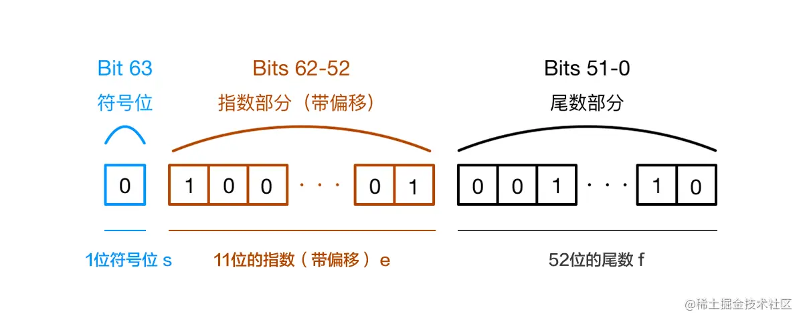
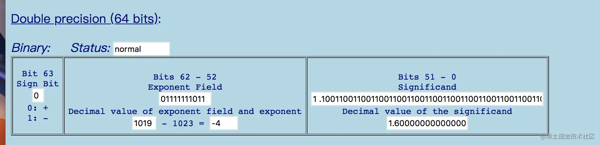

### JavaScript是如何表示数字的？

JavaScript使用Number类型表示数字（整数和浮点数），遵循 [IEEE 754](https://link.juejin.cn?target=https%3A%2F%2Fzh.wikipedia.org%2Fwiki%2FIEEE_754 "https://zh.wikipedia.org/wiki/IEEE_754") 标准 通过64位来表示一个数字

通过图片具体看一下数字在内存中的表示



图片文字说明

* 第0位：符号位，0表示正数，1表示负数(s)
* 第1位到第11位：储存指数部分（e）
* 第12位到第63位：储存小数部分（即有效数字）f

既然说到这里，再给大家科普一个小知识点：js最大安全数是 **Number.MAX_SAFE_INTEGER == Math.pow(2,53) - 1, 而不是Math.pow(2,52) - 1, why？尾数部分不是只有52位吗?**

这是因为二进制表示有效数字总是1.xx…xx的形式，尾数部分f在规约形式下第一位默认为1（省略不写，xx..xx为尾数部分f，最长52位）。因此，JavaScript提供的有效数字最长为53个二进制位（64位浮点的后52位+被省略的1位）

简单验证一下


### 运算时发生了什么？

首先，计算机无法直接对十进制的数字进行运算，这是硬件物理特性已经决定的。这样运算就分成了两个部分：**先按照IEEE 754转成相应的二进制，然后对阶运算**

按照这个思路分析一下0.1 + 0.2的运算过程

#### 1.进制转换

0.1和0.2转换成二进制后会无限循环

```js
0.1 -> 0.0001100110011001...(无限循环)
0.2 -> 0.0011001100110011...(无限循环)

```

但是由于IEEE 754尾数位数限制，需要将后面多余的位截掉（本文借助这个[网站](https://link.juejin.cn?target=https%3A%2F%2Fbabbage.cs.qc.cuny.edu%2FIEEE-754.old%2FDecimal.html "https://babbage.cs.qc.cuny.edu/IEEE-754.old/Decimal.html")直观展示浮点数在内存中的二进制表示）

0.1



0.2


这样在进制之间的转换中精度已经损失

这里还有一个小知识点

**那为什么 x=0.1 能得到 0.1？**

这是因为这个 0.1 并不是真正的0.1。这不是废话吗？别急，听我解释

标准中规定尾数f的固定长度是52位，再加上省略的一位，这53位是JS精度范围。它最大可以表示2^53(9007199254740992), 长度是 16，所以可以使用 toPrecision(16) 来做精度运算，超过的精度会自动做凑整处理

```js
0.10000000000000000555.toPrecision(16)
// 返回 0.1000000000000000，去掉末尾的零后正好为 0.1

// 但来一个更高的精度：
0.1.toPrecision(21) = 0.100000000000000005551

```

这个就是为什么0.1可以等于0.1的原因。好的，继续

#### 2.对阶运算

由于指数位数不相同，运算时需要对阶运算 这部分也可能产生精度损失

按照上面两步运算（包括两步的精度损失），最后的结果是

```js
0.0100110011001100110011001100110011001100110011001100 
```

结果转换成十进制之后就是0.30000000000000004，这样就有了前面的“秀”操作：0.1 + 0.2 != 0.3

所以：

**精度损失可能出现在进制转化和对阶运算过程中**

**精度损失可能出现在进制转化和对阶运算过程中**

**精度损失可能出现在进制转化和对阶运算过程中**

只要在这两步中产生了精度损失，计算结果就会出现偏差

### 怎么解决精度问题？

#### 1.将数字转成整数

这是最容易想到的方法，也相对简单

```js

function add(num1, num2) {
 const num1Digits = (num1.toString().split('.')[1] || '').length;
 const num2Digits = (num2.toString().split('.')[1] || '').length;
 const baseNum = Math.pow(10, Math.max(num1Digits, num2Digits));
 return (num1 * baseNum + num2 * baseNum) / baseNum;
}

```

但是这种方法对大数支持的依然不好

#### 2.三方库

这个是比较全面的做法，推荐2个我平时接触到的库

1).Math.js

专门为 JavaScript 和 Node.js 提供的一个广泛的数学库。支持数字，大数字(超出安全数的数字)，复数，分数，单位和矩阵。 功能强大，易于使用。

官网：[mathjs.org/](https://link.juejin.cn?target=http%3A%2F%2Fmathjs.org%2F "http://mathjs.org/")

GitHub：[github.com/josdejong/m…](https://link.juejin.cn?target=https%3A%2F%2Fgithub.com%2Fjosdejong%2Fmathjs "https://github.com/josdejong/mathjs")

2).big.js

官网：[mikemcl.github.io/big.js](https://link.juejin.cn?target=http%3A%2F%2Fmikemcl.github.io%2Fbig.js "http://mikemcl.github.io/big.js")

GitHub：[github.com/MikeMcl/big…](https://link.juejin.cn?target=https%3A%2F%2Fgithub.com%2FMikeMcl%2Fbig.js%2F "https://github.com/MikeMcl/big.js/")

3）若干，不一一列举了

这几个类库都很牛逼，可以应对各种各样的需求，不过很多时候，一个函数能解决的问题不需要引用一个类库来解决。

**以上就是我对js精准计算的理解，希望可以帮到大家**

**转载必须标明出处，谢谢。文章有疏漏浅薄之处，请各位大神斧正**

### 说明

**看了评论很多人说：其他遵循 [IEEE 754](https://link.juejin.cn?target=https%3A%2F%2Fzh.wikipedia.org%2Fwiki%2FIEEE_754 "https://zh.wikipedia.org/wiki/IEEE_754") 标准的语言也有这个问题，我知道其他的语言也有，但是这篇文章是以js为切入点去分析的，so不要去纠结哪种语言了，文章重点不是语言，谢谢**

**看了评论很多人说：其他遵循 [IEEE 754](https://link.juejin.cn?target=https%3A%2F%2Fzh.wikipedia.org%2Fwiki%2FIEEE_754 "https://zh.wikipedia.org/wiki/IEEE_754") 标准的语言也有这个问题，我知道其他的语言也有，但是这篇文章是以js为切入点去分析的，so不要去纠结哪种语言了，文章重点不是语言，谢谢**

**看了评论很多人说：其他遵循 [IEEE 754](https://link.juejin.cn?target=https%3A%2F%2Fzh.wikipedia.org%2Fwiki%2FIEEE_754 "https://zh.wikipedia.org/wiki/IEEE_754") 标准的语言也有这个问题，我知道其他的语言也有，但是这篇文章是以js为切入点去分析的，so不要去纠结哪种语言了，文章重点不是语言，谢谢**

作者：Gladyu
链接：https://juejin.cn/post/6844903680362151950
来源：稀土掘金
著作权归作者所有。商业转载请联系作者获得授权，非商业转载请注明出处。
